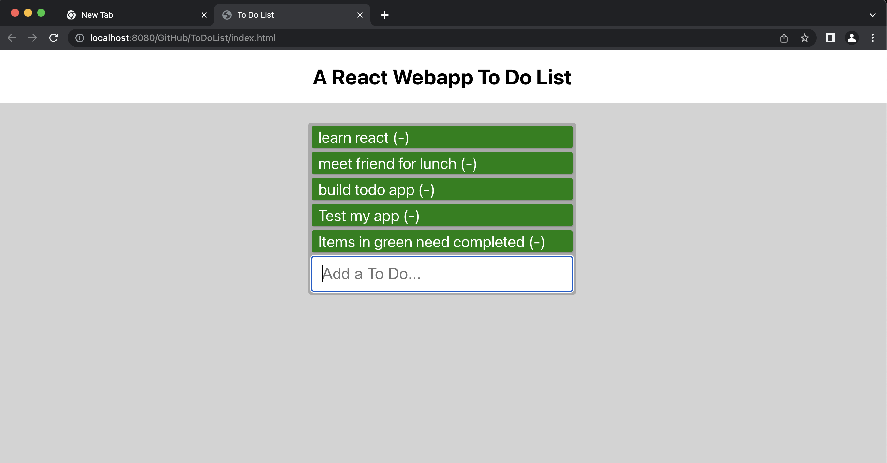

# ToDoList
## This is a webapp built using react

TITLE:
ToDoList

DESCRIPTION:
This application demonstrates how to use react to control a simple to-do list.

HOW TO RUN:
The software is hosted on github here https://github.com/cincimatti/ToDoList.
It can be reached at https://cincimatti.github.io/ToDoList/index.html for live demonstrations.

ROADMAP:
1.) ROADMAPPED FEATURES: No additional features have been roadmapped at this time.

OPERATING INSTRUCTIONS:
The web URL provided will open the webapp landing page. 
A list is desiplayed. Items listed in green show current ToDos.
Users can add more ToDo items to the bottom of the webapp and pass it into the main list.
Users can delete items on the list by clicking that item.

LICENSE INFORMATION: Licensing information can be found in the ToDoList repo locate the "LICENSE" file.